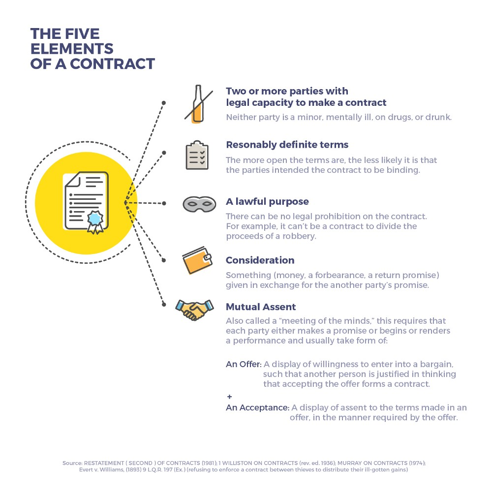

<!-- $theme: gaia -->
<!-- page_number: true -->

# Introduction to  ==Blockchain== and ==Smart Contracts==

###### Created by [Girish Ramnani](https://github.com/girishramnani)

---
<!-- *template: invert -->

# Distributed Systems are hard

---

## Just a distributed lock 

---

### G-Counter

---

# What is blockchain?

---

## Problems solved by blockchain

- Removes single point of failure.
- Every node has the same authority in the network.
- Solves the _Byzantine Generals' problem_.

---

# <small>What are </small>**D**<small>ecentralized apps?</small>

---

---

# 
 Ethereum

---

## Bitcoin vs Ethereum

---

## Transaction

---

## Contracts

---

# 
Smart Contracts    

---

## Solidity

---

## Dev Tools

+ MetaMask
+ Truffle
+ Testrpc
+ Mist 

---

## Example Contracts

+ [Hello World](contracts/Hello_world.sol)
+ [One Value Store](contracts/OneValue.sol)
+ [key value store](contracts/KeyValue.sol)
+ [Voting](contracts/voting.sol)

 

 [StringUtils](contracts/StringUtils.sol) 

---

### Exercise

+ Change the key value store contract such that each key has a owner and only owner can update the content of the key.

---

# Thank you